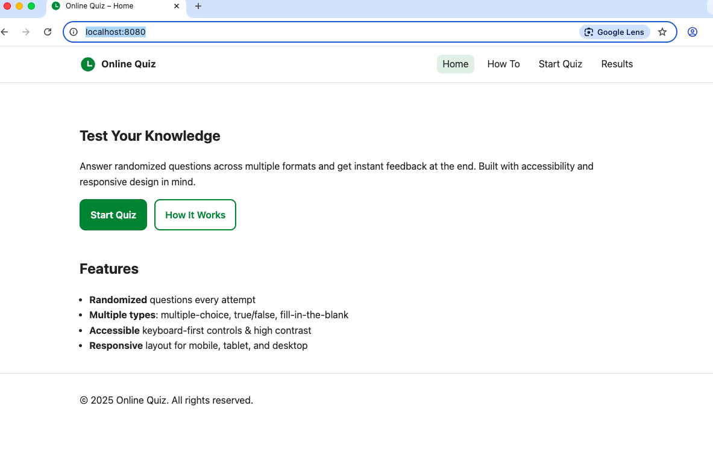
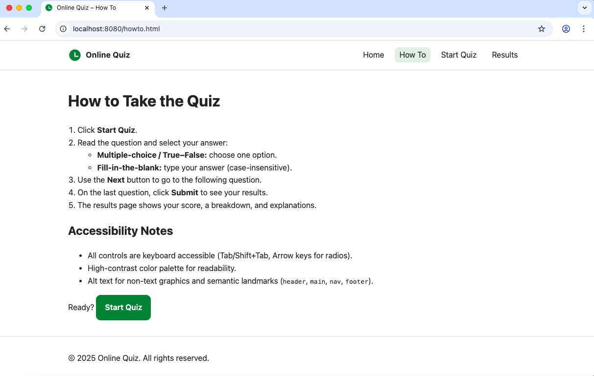
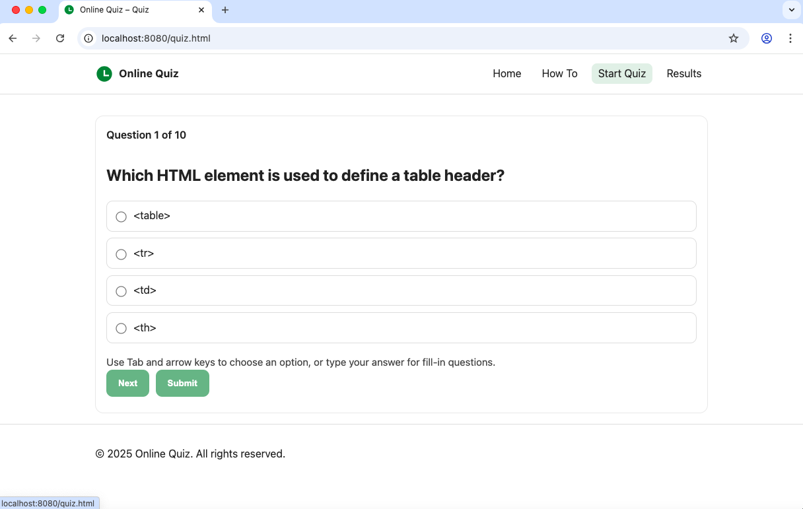
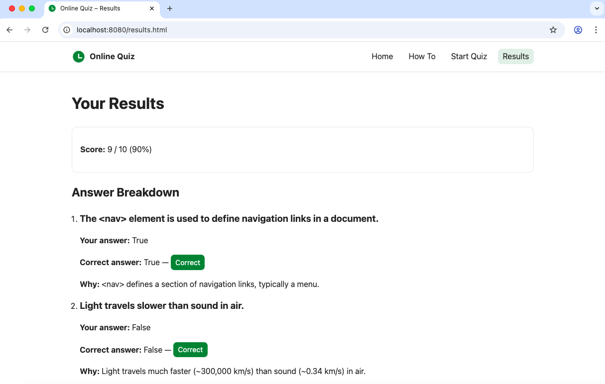

# 🎯 Online Quiz Project

## 📖 Overview
This is a simple **online quiz web application** built with **HTML, CSS, and JavaScript**. Users answer **randomized** questions (multiple-choice, true/false, fill-in-the-blank) and receive a **summary with explanations** at the end.
- **30+ questions** across multiple topics (HTML, CSS, JavaScript, General Knowledge)
- **3 question types**: Multiple choice, True/False, Fill-in-the-blank
- **Randomized order** - different experience each time
- **Instant feedback** with detailed explanations
- **Accessible design** - keyboard navigation, screen reader friendly
- **Responsive layout** - works on all devices
- Clean, commented code that validates and lints
---

## ✨ Features

### 🎲 Quiz Functionality
- 10 randomly selected questions from a pool of 30+
- Multiple choice, boolean (True/False), and text input questions
- Progress tracking (Question X of 10)
- Skip questions or provide answers
- Immediate results with score calculation

### ♿ Accessibility
- Semantic HTML5 landmarks (`header`, `nav`, `main`, `footer`)
- Skip link for keyboard users
- ARIA labels and proper form associations
- High contrast color scheme
- Keyboard-only navigation support

### 📱 Responsive Design
- Mobile-first approach
- Optimized for screens 320px to 1200px+
- Touch-friendly interface
- Flexible grid layout
---


## 🖼️ Screenshots

### Home Page

*Landing page with quiz introduction and call-to-action buttons*

### How To Page

*Step-by-step instructions for taking the quiz*

### Quiz Interface

*Clean quiz interface showing question progress and navigation*

### Results Page

*Detailed results with score breakdown and explanations*

---

## 📂 Project Structure
```
Online-Quiz/
├── 📁 screenshots/
│   ├── Home.png           # Screenshot: Landing page
│   ├── HowTo.png          # Screenshot: Instructions
│   ├── Quiz.png           # Screenshot: Quiz interface
│   └── Result.png         # Screenshot: Results page
├── 📁 scripts/
│   ├── quiz.js            # Main quiz logic and navigation
│   ├── questions.js       # Question database (30+ questions)
│   └── script.js          # Utility functions and results rendering
├── 📁 styles/
│   └── style.css          # Complete styling with responsive design
├── 📁 validation-reports/
│   ├── css-validation.md  # css validation report
│   ├── fix-log.md         # log for fixing the warnings and errors
│   ├── html-validation.md # html validation report
│   └── js-validation.md   # js validation report
├── .gitignore             # Git ignore rules
├── favicon.ico            # Site favicon
├── index.html             # Landing page
├── howto.html             # Instructions page
├── quiz.html              # Quiz interface
├── results.html           # Results display
└── README.md              # This file with all important information about the project
```
---

## 🚀 Getting Started
### Prerequisites
- Modern web browser (Chrome, Firefox, Safari, Edge)
- Local web server (for development)

### Installation & Setup

1. **Clone the repository**
   ```bash
   git clone https://github.com/your-username/Online-Quiz.git
   cd Online-Quiz
   ```

2. **Start a local server**
   ```bash
   # Using Python 3
   python3 -m http.server 8080

   # Or on Windows systems
   python -m http.server 8080
   
   # Using Node.js 
   npx http-server -p 8080
   
   # Using VS Code Live Server extension
   # Right-click index.html → "Open with Live Server"
   ```

3. **Open in browser**
   Navigate to `http://localhost:8080`

---

## 🌐 Deploy to GitHub Pages
1. **Push to GitHub**
   ```bash
   git init
   git add .
   git commit -m "Initial commit: Online Quiz Project"
   git branch -M main
   git remote add origin https://github.com/ranjanaeng/Online-Quiz.git
   git push -u origin main
   ```

2. **Enable GitHub Pages**
   - Go to repository Settings → Pages
   - Source: Deploy from branch → `main` → `/root`
   - Save

3. **Access your live site**
   Your quiz will be available at: `https://ranjanaeng.github.io/Online-Quiz/`

---

## ⚙️ How to Use
1. **Start**: Visit the home page and click "Start Quiz"
2. **Navigate**: Read instructions on "How It Works" page
3. **Take Quiz**: 
   - Answer 10 randomly selected questions
   - Use Next button to proceed (skip if needed)
   - Submit on the final question
4. **Review**: Check your score and read explanations

---

## 🛠️ Technologies Used

- **HTML5**: Semantic markup, accessibility features
- **CSS3**: Flexbox, Grid, Media queries, Custom properties
- **JavaScript (ES6)**: Modular code, Local Storage, DOM manipulation
- **No external dependencies** - Pure vanilla implementation

---

## ⚙️ Customization

### Adding Questions
To limit or extend the number of questions, simply add/remove entries. The app uses all questions and randomizes order each attempt.

Edit `scripts/questions.js` to add new questions:

```javascript
{
  type: 'mcq',  // 'mcq', 'boolean', or 'text'
  question: 'What does HTML stand for?',
  options: ['HyperText Markup Language', 'Home Tool Markup Language', 'Hyperlinks and Text Markup Language'],
  answer: 'HyperText Markup Language',
  explanation: 'HTML stands for HyperText Markup Language, the standard markup language for web pages.'
}
```
### Changing Quiz Length
Modify `QUIZ_LENGTH` in `scripts/quiz.js`:
```javascript
var QUIZ_LENGTH = 10; // Change to desired number of questions
```

### Styling
Customize colors and layout in `styles/style.css`:
```css
:root {
  --accent: #2e7d32;  /* Primary color */
  --bg: #ffffff;      /* Background color */
  --text: #222222;    /* Text color */
}
```
---

## ✅ Quality Assurance

### Validation
- ✅ **HTML**: W3C Markup Validator[W3C Validator](https://validator.w3.org/) 
- ✅ **CSS**: W3C CSS Validator (Jigsaw)[Jigsaw Validator](https://jigsaw.w3.org/css-validator/)  
- ✅ **JavaScript**: JSHint **JSHint**(https://jshint.com)- Clean code, strict mode

### Testing Checklist
- ✅ All navigation links functional
- ✅ Questions randomize on each attempt
- ✅ Keyboard-only navigation works
- ✅ Screen reader compatibility
- ✅ Mobile responsive (320px+)
- ✅ Cross-browser compatibility
- ✅ Score calculation accuracy
- ✅ LocalStorage persistence

---

🧩 Accessibility & UX
- Semantic HTML structure
- ARIA labels and descriptions
- Skip navigation link
- Keyboard focus management
- High contrast ratios (WCAG AA compliant)
- Screen reader announcements

---

## 🤝 Contributing
1. Fork the repository
2. Create a feature branch (`git checkout -b feature/new-feature`)
3. Commit changes (`git commit -m 'Add new feature'`)
4. Push to branch (`git push origin feature/new-feature`)
5. Open a Pull Request

---

## 📄 License
This project is licensed under the MIT License - see the [LICENSE](LICENSE) file for details.
MIT — feel free to use, modify, and learn from this project.

---

## 👨‍💻 Author
**Ranjana Kaushik**
- GitHub: [@ranjanakaushik](https://github.com/ranjanakaushik)
- Project: [Online Quiz](https://github.com/ranjanakaushik/Online-Quiz)

---

## ✍️ Attribution
All code in this repository was written from scratch for this project.
If you add external snippets/libraries, credit them inline via comments and here in the README.

---


## 📜 Credits
- All custom code written by Ranjana Kaushik
- Built as a learning project to demonstrate modern web development practices
- All code written from scratch without external libraries
- Question content covers web development fundamentals and general knowledge

---

⭐ **Star this repository if you found it helpful!**


